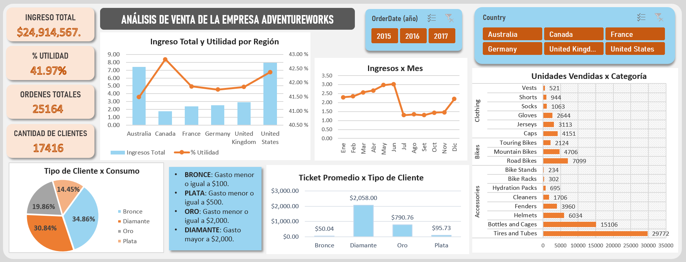

# Retail Sales Optimization & Customer Analytics | AdventureWorks Case Study

## 1. 📈Executive Summary 
Este análisis integral de ventas revela una transformación clave tras la diversificación de 2016, logrando un incremento de $2.9M en ingresos y triplicando la base de clientes con respecto al 2015. El estudio destaca una estructura de consumo muy definida: el 34.86% de la población son clientes *"Bronce"* (ticket promedio $50), mientras que el segmento *"Diamante"*, aunque representa el 30.84% de los clientes, constituye el motor financiero con un ticket promedio de $2,058, evidenciando una sólida base de compradores de alto valor.

Geográficamente, el modelo identifica una brecha de eficiencia: Australia genera el segundo mayor volumen de ingresos con la rentabilidad más baja, mientras que Canadá registra los ingresos más bajos pero alcanza la rentabilidad más alta. La estrategia final propone optimizar márgenes en mercados de alto volumen replicando la eficiencia canadiense y capitalizar el flujo masivo de clientes de accesorios (como Tires and Tubes y Bottles) para escalarlos hacia productos de alta gama, mejorando la rentabilidad global.
_______

## 2. 🚩 Problem Statement & Objectives
**The Problem**

AdventureWorks enfrentaba una dispersión de datos que impedía conocer la rentabilidad real por región y el perfil exacto de sus consumidores lo que dificultaba la toma de decisiones informada. Los desafíos principales eran:
- *Dispersión de Datos:* Incapacidad para identificar con precisión qué productos, mercados o territorios eran realmente los más rentables.
- *Fluctuaciones sin explicación:* Se detectaron variaciones en las ventas a lo largo del tiempo, pero no se comprendían las causas ni el desempeño histórico real.
- *Desconocimiento del Cliente:* No se tenía claridad sobre el tamaño de la base de clientes ni sobre su comportamiento de compra, lo que impedía diferenciar a los segmentos más valiosos de los ocasionales.

**Project Objectives**

- **1. Centralizacion de información:** Unificar los datos dispersos en una sola fuente de verdad utilizando Power Query para facilitar el análisis.
- **2. Análisis de desempeño temporal:** Desarrollar visualizaciones que permitan entender la evolución de las ventas e identificar tendencias y causas de fluctuación.
- **3. Segmentación estratégica:** Implementar una lógica dinámica en DAX para conocer cuántos clientes existen y categorizarlos según su comportamiento de compra (Diamante, Oro, Plata, Bronce).
- **4. Identificación de rentabilidad:** Crear un dashboard interactivo que permita visualizar qué territorios y productos generan el mayor impacto financiero para la empresa.
___________

## 3. 📊 Interactive Dashboard 

*Nota. Este dashboard interactivo permite filtrar por año y país, además contiene KPIs importantes de venta, utilidad, órdenes y clientes. Se destaca también la segmentación dinámica de clientes donde se observa la diferencia entre el volumen de clientes "Bronce" con la alta rentabilidad del segmento "Diamante".*
_____________
## 4. 🛠️ Data Process / Methodology
Para este proyecto se aplicó un flujo de trabajo optimizado, priorizando el rendimiento del archivo y la integridad de los cálculos:

### Conexión y Limpieza (Power Query)
Se importaron las tablas de dimensiones y de hechos directamente al motor de Power Query:
* **Optimización de Memoria:** Los archivos se cargaron únicamente como **"Conexión"**, evitando el volcado de datos en las hojas de Excel para mantener un archivo ligero.
* **Transformación de Datos:**
    * Se convirtieron columnas de costo y precio unitario a **formato numérico**.
    * Se crearon columnas calculadas para **Mes** y **Año**.
    * Se realizó una **concatenación de nombres** (First Name + Last Name) para consolidar la identidad del cliente.
    * Se eliminaron columnas irrelevantes para reducir el peso del modelo.
### Modelado de Datos (Power Pivot)
* **Esquema Estrella:** Se establecieron relaciones sólidas conectando todas las tablas de dimensiones hacia la tabla de hechos (*Sales*).
* **Integridad Referencial:** Este modelo permite que todas las visualizaciones respondan de forma sincronizada a los filtros aplicados.
### Desarrollo de Medidas DAX
* **Métricas Base:** Ingresos totales, margen de utilidad, porcentaje de utilidad, ticket promedio, clientes totales y conteo de órdenes únicas.
* **Lógica de Negocio:** Implementación de segmentación dinámica para categorizar a los clientes según su volumen de consumo.
### Visualización y Diseño
* **Análisis Dinámico:** Creación de tablas y gráficos dinámicos conectados a segmentadores de Año y Región.
* **Diseño UI:** Aplicación de una paleta de colores armonizada para facilitar la lectura de los KPIs y dar un acabado profesional al proyecto.
________
## 5.
