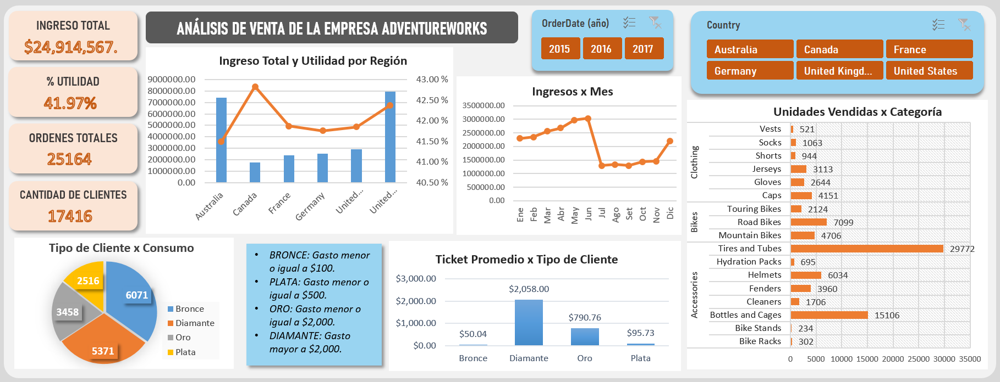

# Retail Sales Optimization & Customer Analytics | AdventureWorks Case Study

## 1. 📈Executive Summary 
Este análisis integral de ventas y segmentación de clientes revela una *transformación clave* en el modelo de negocio tras la diversificación de categorías en el 2016, logrando un incremento de **$2.9M** en ventas y triplicando la base de clientes, con respecto al 2015. El estudio destaca un contraste crítico de valor: mientras el volumen masivo proviene de clientes *"Bronce"* (ticket promedio $50), el motor de ingresos reside en el segmento *"Diamante"*, con un ticket promedio de $2,058.

En términos geográficos, el análisis identifica una brecha de eficiencia al comparar los polos opuestos del mercado: *Australia*, que genera el segundo mayor volumen de ingresos a nivel global, opera con la rentabilidad más baja del modelo; por el contrario, *Canadá* registra los ingresos más bajos pero alcanza la rentabilidad más alta. Esta disparidad sugiere una oportunidad para optimizar los márgenes en mercados de alto volumen replicando las políticas de eficiencia canadienses. La estrategia final propone **capitalizar el flujo masivo de nuevos clientes de accesorios** para convertirlos en compradores de productos de alta gama (bicicletas), escalando la rentabilidad en las regiones de mayor escala.
_______

## 2. 📊 Dashboard Interactivo

*Nota. Este dashboard interactivo permite filtrar por año y país, además contiene KPIs importantes de venta, utilidad, órdenes y clientes. Se desataca tambien la segmentación dinámica de clientes donde se observa la diferencia entre el volumen de clientes "Bronce" con la alta rentabilidad del segmento "Diamante".*
